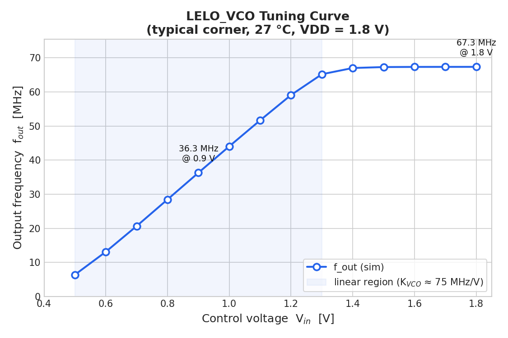

# Who
n.mahmoudi

# Why

The main target is to design a VCO cell to be used to measure internal voltages inside a SoC.

# How

The VCO core is a current-starving VCO design extracted from the papers in the state-of-the-art.

# What

| What            |        Cell/Name |
| :----              |  :----:       |
| Schematic       | design/LELO_VCO_SKY130A/LELO_VCO.sch |
| Layout          | design/LELO_VCO_SKY130A/LELO_VCO.mag |

# Changelog/Plan

| Version | Status | Comment|
| :---| :---| :---|
|0.1.0 | :x: | Make something |

# Signal interface

| Signal       | Direction | Domain  | Description                               |
| :---         | :---:     | :---:   | :---                                      |
| VDD_1V8         | Input     | VDD_1V8 | Main supply                              |
| VSS         | Input     | Ground  |                                           |
| PWRUP_1V8     | Input    | VDD_1V8 | Power up the circuit                       |

# Key parameters

| Parameter           | Min     | Typ           | Max     | Unit  |
| :---                | :---:     | :---:           | :---:     | :---: |
| Technology          |         | Skywater 130 nm |         |       |
| AVDD                | 1.7    | 1.8           | 1.9    | V     |
| Temperature         | -40     | 27            | 125     | C     |

# Characterization

Tuning curve (output frequency vs. control voltage). Typical K_VCO ≈ 75 MHz/V,
usable range ≈ 0.5–1.3 V, ~6 → 67 MHz. Details and PVT-corner spread in
[sim/VCO/TUNING.md](sim/VCO/TUNING.md).

