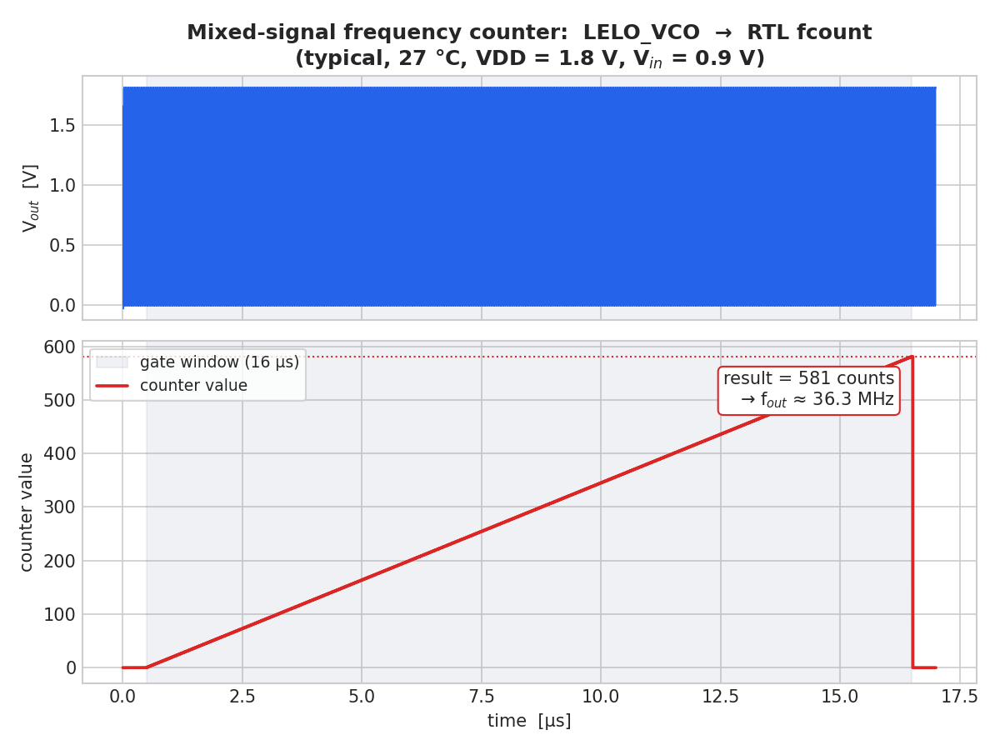
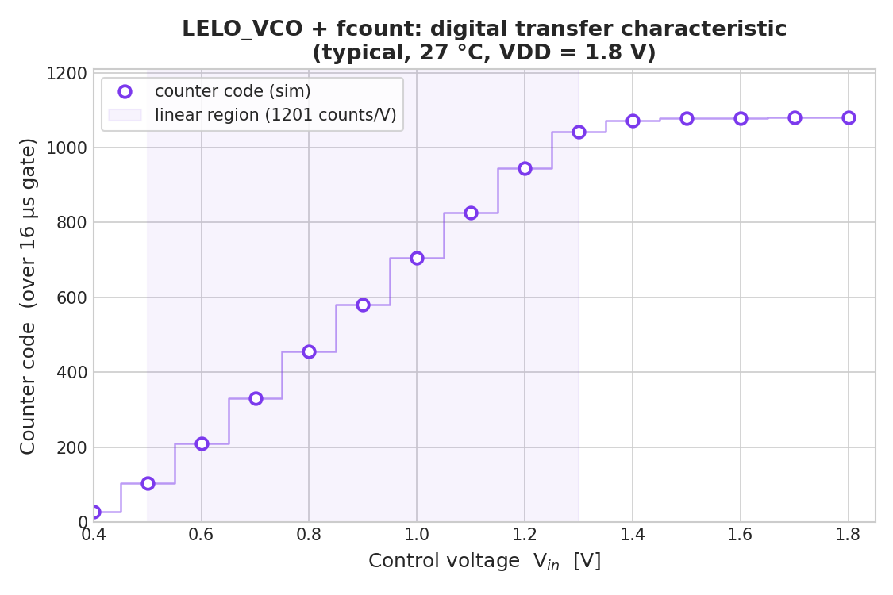

# FCOUNT — mixed-signal VCO frequency counter

Digital read-out for the VCO-based voltage sensor: an RTL counter counts
`LELO_VCO` output cycles over a fixed gate window, producing a digital code
proportional to `f_out` (and therefore to the control voltage `Vin`).

This is a **mixed-signal** simulation — the analog VCO and the synthesizable
Verilog counter are co-simulated together in ngspice (Verilator `d_cosim`),
following the [mixed-signal ngspice tutorial](https://analogicus.com/aic2026/mixed_signal_simulation_in_ngspice).



## Blocks

| Item | File |
|------|------|
| Counter RTL | [`../../rtl/fcount.v`](../../rtl/fcount.v) |
| Testbench   | [`tran.spi`](tran.spi) |
| Plot        | [`plot_count.py`](plot_count.py) |

`fcount` counts rising edges of `clk` while `gate` is high and latches the
tally into `result` when the window closes:

```
result = f_out * T_gate      (VCO cycles in the window)
```

## How it is wired

- The analog `Vout` is tied to the counter's `clk` input; ngspice's automatic
  `adc_bridge` converts the 0–1.8 V swing into a digital clock.
- The digital output bus is decoded back to a real value `dec_result`
  (= count / 1000) by the generated `svinst.spi`; the digital output bridge is
  overridden to 1.8 V levels in the `.control` block.

## Run

```bash
make count
```

This (1) compiles the RTL to `fcount.so` via `ngspice vlnggen` (Verilator),
(2) generates the SPICE instance with `tech/script/gensvinst`, (3) co-simulates
with the VCO, and (4) writes `fcount_demo.png`.

## Result (typical, 27 °C, VDD = 1.8 V, Vin = 0.9 V)

- Gate window `T_gate = 16 µs`.
- Measured **result = 581 counts** → f_out ≈ 581 / 16 µs = **36.3 MHz**,
  matching the analog transient/tuning-curve value (~36.3 MHz).

The ±1-count quantization sets the resolution: 1 LSB = 1/T_gate = **62.5 kHz**
with the 16 µs window. A longer gate (or reciprocal counting) trades
measurement time for finer resolution.

## Digital transfer characteristic (code vs Vin)

Sweeping `Vin` and recording the counter code gives the ADC-style transfer
curve of the sensor (`make sweep`, via [`sweep_count.py`](sweep_count.py)):



| Vin [V] | count | | Vin [V] | count |
|--------:|------:|-|--------:|------:|
| 0.40 | 28  | | 1.10 | 827  |
| 0.50 | 103 | | 1.20 | 945  |
| 0.60 | 210 | | 1.30 | 1042 |
| 0.70 | 330 | | 1.40 | 1072 |
| 0.80 | 456 | | 1.50–1.80 | ~1080 |
| 0.90 | 581 | |      |      |
| 1.00 | 705 | |      |      |

- **Sensitivity ≈ 1200 counts/V** in the linear region (= K_VCO 75 MHz/V ×
  16 µs gate), saturating at ~1080 counts.
- The code is exactly `f_out × T_gate`, so this is the digitized tuning curve —
  Vin = 0.9 V → 581 counts matches 36.3 MHz × 16 µs, and 1.8 V → 1080 matches
  67.5 MHz × 16 µs.
- Resolution is 1 LSB = 1 count = 1/T_gate = **62.5 kHz**. Widen `T_gate` for
  finer resolution (12-bit counter allows up to 4095 counts before overflow).

## Generated (git-ignored) artifacts

`fcount.so`, `svinst.spi`, `fcount_obj_dir/`, `fcount_wave.dat` — all
regenerated by `make count` / `make sweep`.
