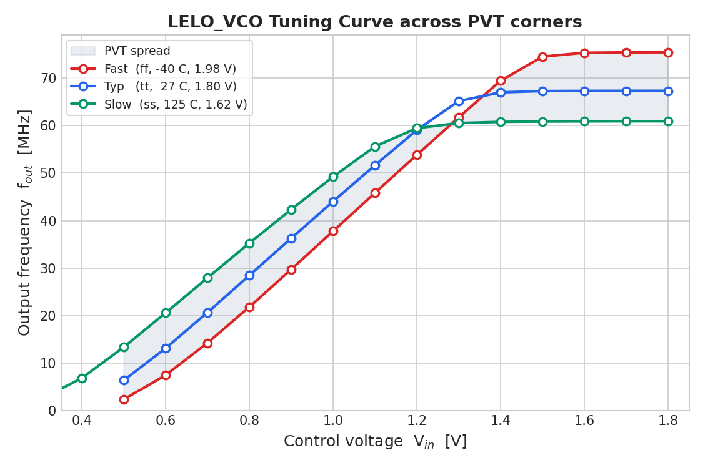

# LELO_VCO Tuning Curve (f_out vs V_in)

Characterization of the VCO control characteristic: the output oscillation
frequency `f_out` as a function of the control voltage `V_in`.

`LELO_VCO` is a current-starved ring oscillator. `V_in` drives the gate of the
current-starving device (`XM27`, W = 96 µm), so a higher `V_in` delivers more
tail current and a higher oscillation frequency.


## How to run

From this directory (inside the `wulffern/aicex` container):

```bash
make sweep
```

This runs [`sweep.spi`](sweep.spi) and [`plot_tuning.py`](plot_tuning.py) and
regenerates [`vco_tuning.dat`](vco_tuning.dat) and `vco_tuning_curve.png`.

## Method

- **Netlist:** the extracted schematic netlist `../../work/xsch/LELO_VCO.spice`
  (run `make netlist` first if the schematic changed).
- **Corner:** typical models (`sky130.lib.spice tt`), 27 °C, VDD = 1.8 V.
- **Sweep:** `V_in` from 0.30 V to 1.80 V in 0.10 V steps.
- **Frequency measurement:** at each `V_in`, a 3 µs transient is run and
  `f_out` is measured from `Vout` rising edges (5 periods, skipping the first
  cycles for start-up) — the same edge-timing method as `tran.meas`.
- Points that do not oscillate produce no frequency and are dropped.

## Results (typical, 27 °C, VDD = 1.8 V)

| V_in [V] | f_out [MHz] | Region            |
|---------:|------------:|-------------------|
| ≤ 0.40   | —           | below threshold (no oscillation) |
| 0.50     | 6.4         | linear            |
| 0.60     | 13.1        | linear            |
| 0.70     | 20.7        | linear            |
| 0.80     | 28.5        | linear            |
| 0.90     | 36.3        | linear            |
| 1.00     | 44.0        | linear            |
| 1.10     | 51.7        | linear            |
| 1.20     | 59.1        | linear            |
| 1.30     | 65.2        | linear            |
| 1.40     | 67.0        | saturating        |
| 1.50–1.80| ~67.3       | saturated         |

- **Usable (near-linear) range:** ≈ 0.5–1.3 V.
- **VCO gain:** K_VCO ≈ 75 MHz/V in the linear region.
- **Frequency span:** ≈ 6 → 67 MHz.
- The typical operating point `V_in = 0.9 V → 36.3 MHz` matches the transient
  testbench golden value.

## PVT corner spread

The tuning curve across process / temperature / supply corners is generated by
[`sweep_corners.py`](sweep_corners.py):

```bash
make sweep_corners
```

Outputs [`vco_tuning_corners.dat`](vco_tuning_corners.dat) and
`vco_tuning_corners.png`.



| Corner | Process | Temp   | VDD    | f_out span |
|--------|---------|--------|--------|------------|
| Fast   | ff      | −40 °C | 1.98 V | up to ~75 MHz |
| Typ    | tt      |  27 °C | 1.80 V | up to ~67 MHz |
| Slow   | ss      | 125 °C | 1.62 V | up to ~61 MHz |

The curves **cross** near V_in ≈ 1.2 V, which is expected for this topology:

- In the **tuning region** the slow/hot corner sits *highest* — at 125 °C the
  threshold voltage is lower, so a given `V_in` delivers more starving current
  and a higher frequency.
- The fast/cold corner has a **larger dead-zone** (higher V_t needs more `V_in`
  to start oscillating).
- At **saturation** the ordering flips to the intrinsic device speed × supply:
  fast (75) > typ (67) > slow (61) MHz.

## Notes

- Below ~0.5 V the ring does not have enough current to sustain oscillation.
- Above ~1.4 V the current-starving device is fully on, so the frequency
  saturates.
- The exact saturated frequency is mildly sensitive to transient tolerances /
  timestep (short periods at high frequency); the committed `.dat` files
  reflect what `make sweep` / `make sweep_corners` reproducibly generate.
